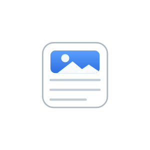
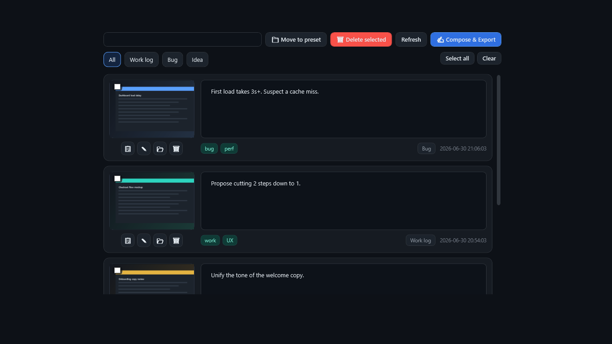
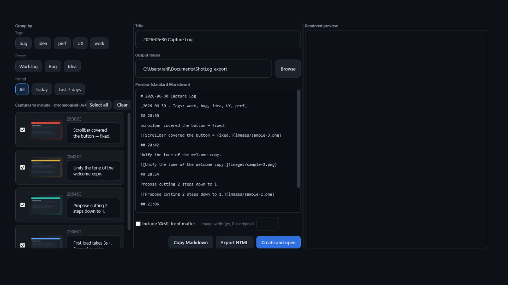
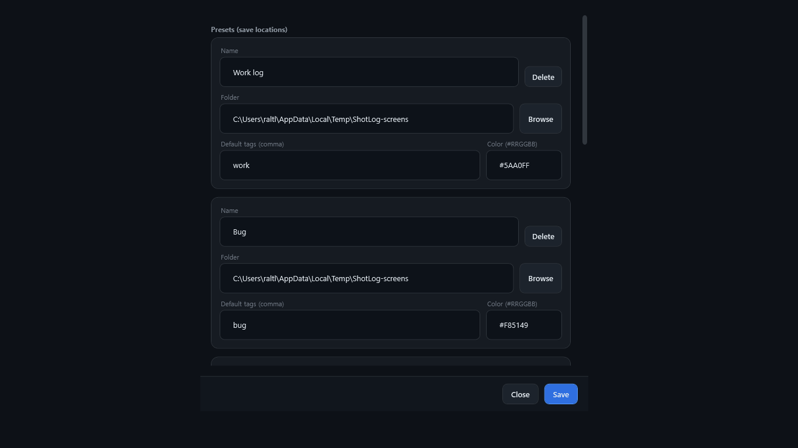
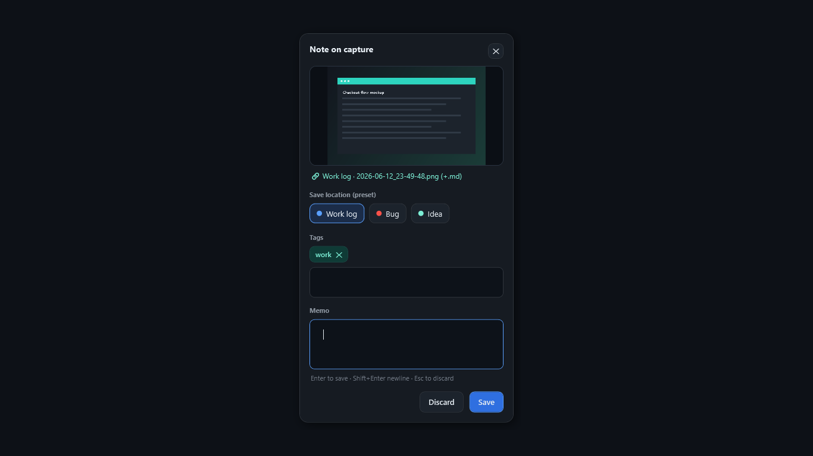
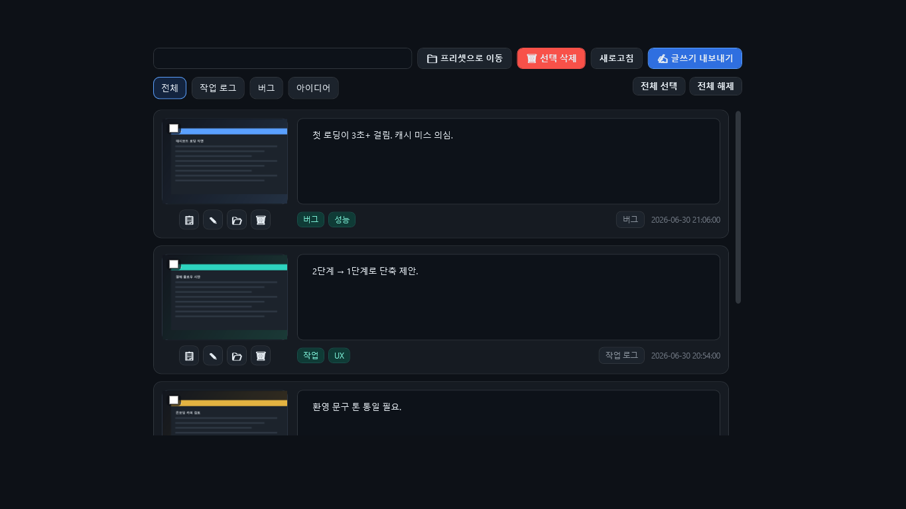
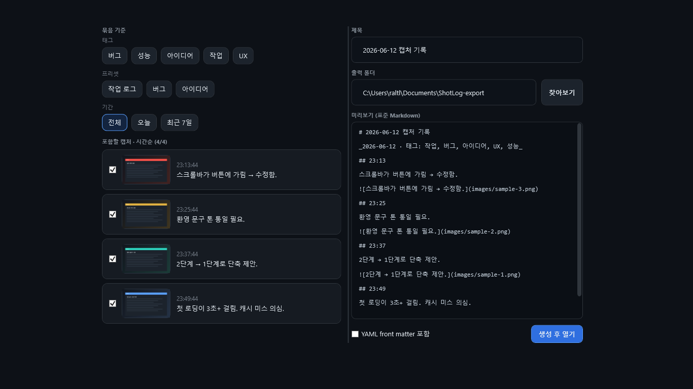
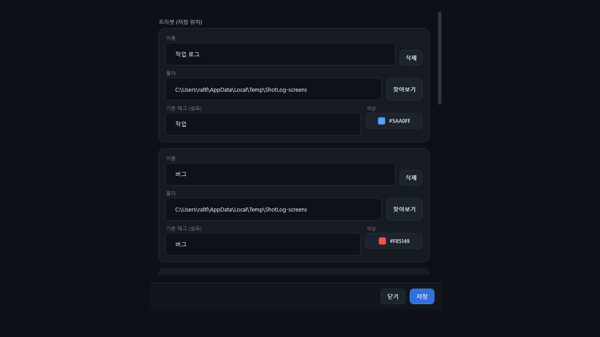
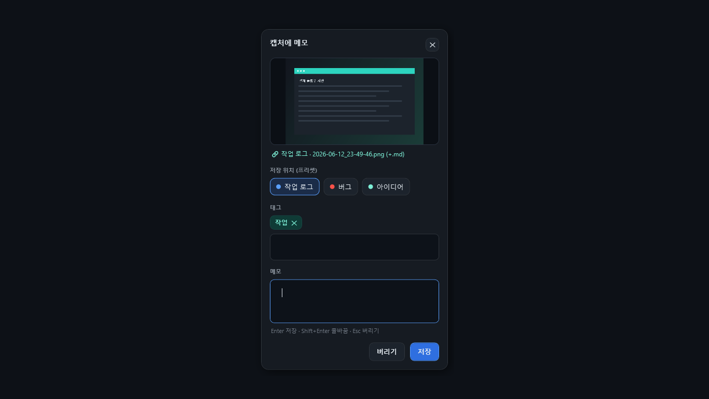

<p align="center">
  
</p>

<h1 align="center">ShotLog</h1>

<p align="center">
  <b>Capture your screen, jot a note on the spot, organize — in one go.</b><br/>
  <b>화면을 캡처하고, 그 자리에서 메모하고, 한 번에 정리하세요.</b>
</p>

<p align="center">
  Windows 10/11 · .NET 8 (WPF) · system-tray · <b>Korean / English UI</b> · local-only, no network
</p>

---

> **Language / 언어:** ShotLog ships with both **English and Korean** UI. Pick one in
> **Settings → General → Language** (`System (auto)` / `한국어` / `English`); the change applies
> instantly, no restart. `System (auto)` follows your Windows display language.

---

## English

### What is ShotLog?

ShotLog is a lightweight, tray-resident screenshot tool for people who think while they capture.
Press a hotkey to grab the screen, type the thought that prompted it, and ShotLog files it away in a
preset folder. Later, review everything in the **Inbox** and export a clean, portable **Markdown**
document. Everything stays on your device — ShotLog makes **no network calls** of any kind.

### Features

- **Five capture modes** — *Instant* (active monitor → straight to the active preset, no UI), *Capture + Memo*, *Region select* (with a live size readout), *Active window*, and *Capture to clipboard* (straight to the clipboard, no file).
- **Global hotkeys** that work over any app, fully remappable in Settings.
- **Presets** that bundle a destination folder, an accent color, and default tags — choose one at capture time.
- **Annotate** — draw freehand, highlight, and add arrows / boxes / text on a capture before saving, or re-edit a saved one from the Inbox.
- **Inbox** — browse recent captures as thumbnails; edit memos/tags inline; search, filter by preset; copy to clipboard, show in Explorer, and delete (single or multi-select).
- **Compose & Export** — filter by tag / preset / date, pick what to include, and export a chronological **Markdown** document with a sibling `images/` folder (opens as-is in GitHub, Obsidian, VS Code). A side-by-side **rendered preview** shows how it will look; you can also copy the Markdown or export a single self-contained **HTML** file.
- **Sidecar** *(optional)* — a same-named `.md` written next to each PNG so notes are visible in Explorer too.
- **Local-only** — screenshots and notes live on your device. No uploads, no analytics, no tracking.
- Tray-resident · single-instance · optional start-with-Windows · **Korean / English UI**.

### Screenshots

**Inbox** — recent captures with inline memo/tag editing, search and preset filters.


**Compose & Export** — filter, select, preview, and export portable Markdown.


**Settings** — presets, hotkeys, export options, autostart, and the language toggle.


**Quick Note** — the memo card that appears right after a capture.


### Build & run

```powershell
dotnet build ShotLog.sln
dotnet run --project src/ShotLog/ShotLog.csproj
```

Windows-only (targets `net8.0-windows`, runtime floor Windows 10 1809 / build 17763). See
[`CLAUDE.md`](CLAUDE.md) for architecture and [`docs/store/STORE_RELEASE.md`](docs/store/STORE_RELEASE.md)
for the Microsoft Store (MSIX) release checklist.

> The Compose window's rendered preview uses the **WebView2 runtime** (preinstalled on Windows 11). If it is missing, the text preview still works.

### Privacy

ShotLog stores screenshots and notes locally and transmits nothing.
Full policy: **https://slnu21.github.io/ShotLog/store/privacy-policy.html**

---

## 한국어

### ShotLog란?

ShotLog는 "캡처하면서 생각하는" 사람을 위한 가벼운 **트레이 상주** 스크린샷 도구입니다.
단축키 한 번으로 화면을 잡고, 떠오른 생각을 바로 적어 두면 ShotLog가 프리셋 폴더에 정리해 둡니다.
나중에 **인박스**에서 모아 보고, 깔끔한 **Markdown** 문서로 내보낼 수 있습니다. 모든 데이터는 내 기기에만
저장되며 **네트워크 전송이 전혀 없습니다**.

### 주요 기능

- **다섯 가지 캡처 모드** — *즉시 캡처*(활성 모니터 → 활성 프리셋에 바로 저장, UI 없음), *캡처 + 메모*, *영역 선택*(드래그 중 크기 표시), *활성 창*, *클립보드로 캡처*(파일 없이 클립보드로 바로).
- **전역 단축키** — 어떤 앱 위에서도 동작, 설정에서 자유롭게 변경.
- **프리셋** — 저장 폴더·강조 색상·기본 태그를 묶어 두고 캡처 시 선택.
- **주석(편집)** — 저장 전 캡처에 펜 드로잉·형광펜·화살표/사각형/텍스트 추가, 인박스에서 기존 캡처도 다시 편집.
- **인박스** — 최근 캡처를 썸네일로 보고, 메모/태그를 인라인 편집, 검색·프리셋 필터, 클립보드 복사·탐색기에서 보기·삭제(개별/다중 선택).
- **글쓰기 내보내기** — 태그/프리셋/기간으로 골라, 시간순 **Markdown** 문서 + `images/` 폴더로 내보내기(GitHub·Obsidian·VS Code에서 그대로 열림). 옆에 **렌더링 미리보기**로 실제 모습 확인, 마크다운 복사 또는 단일 **HTML** 파일 내보내기도 가능.
- **사이드카** *(선택)* — PNG 옆에 같은 이름 `.md`를 함께 저장해 탐색기에서도 메모 확인.
- **로컬 전용** — 스크린샷·메모는 내 기기에만. 업로드·분석·추적 없음.
- 트레이 상주 · 단일 인스턴스 · Windows 시작 시 자동 실행(선택) · **한국어 / 영어 UI**.

### 스크린샷

**인박스** — 최근 캡처 목록, 인라인 메모/태그 편집, 검색·프리셋 필터.


**글쓰기 내보내기** — 필터·선택·미리보기 후 Markdown으로 내보내기.


**설정** — 프리셋·단축키·내보내기·자동 실행·언어 전환.


**빠른 메모** — 캡처 직후 나타나는 메모 카드.


### 빌드 & 실행

```powershell
dotnet build ShotLog.sln
dotnet run --project src/ShotLog/ShotLog.csproj
```

Windows 전용(`net8.0-windows`, 최소 Windows 10 1809 / 빌드 17763). 구조는
[`CLAUDE.md`](CLAUDE.md), Microsoft Store(MSIX) 출시 절차는
[`docs/store/STORE_RELEASE.md`](docs/store/STORE_RELEASE.md) 참고.

> 글쓰기 내보내기의 렌더링 미리보기는 **WebView2 런타임**(Windows 11 기본 탑재)을 사용합니다. 없을 경우 텍스트 미리보기는 그대로 동작합니다.

### 개인정보

ShotLog는 스크린샷과 메모를 로컬에만 저장하며 아무것도 전송하지 않습니다.
전체 방침: **https://slnu21.github.io/ShotLog/store/privacy-policy.html**
